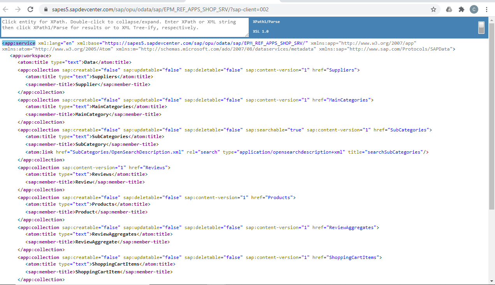
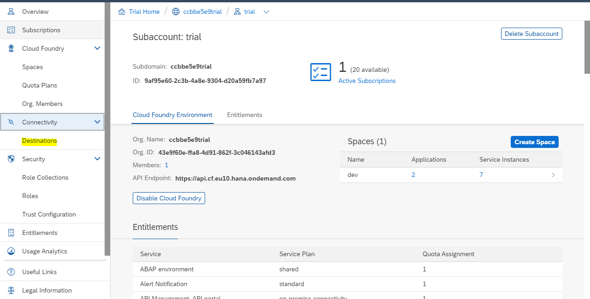
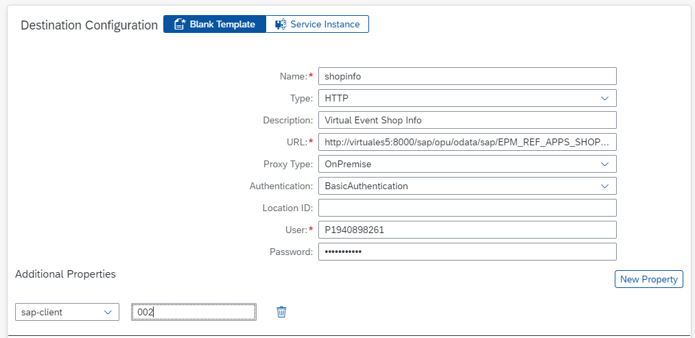
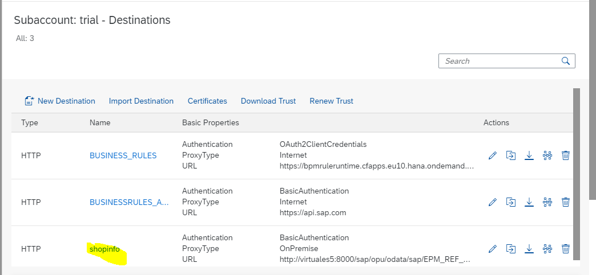
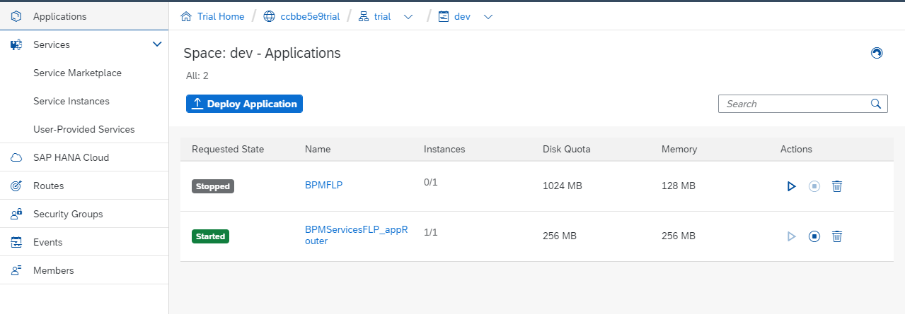

# Create destination in Cloud platform

- [Create destination in Cloud platform](#create-destination-in-cloud-platform)
  - [Check the data source](#check-the-data-source)
  - [Create a new destination definition](#create-a-new-destination-definition)
  - [Deploy a simple app to test the destination connection](#deploy-a-simple-app-to-test-the-destination-connection)

## Check the data source
Before creating the destination, which is effectively a pointer to a data source, it's worth checking that data source manually and directly. First, so you can see for yourself what you're aiming to get to from within the SAP Cloud Platform, and second, so you know what you're looking for when you access that data source indirectly (through the destination).
- Open up the [EPM_REF_APPS_SHOP_SRV](https://sapes5.sapdevcenter.com/sap/opu/odata/sap/EPM_REF_APPS_SHOP_SRV/?sap-client=002) OData service, taking care to specify client 002 in the URL
  

## Create a new destination definition
Go to your "Trial Subaccount Home" page, and select the "Destinations" menu item within the "Connectivity" item

Select the "New Destination" option, and in the configuration specify values for the appropriate parameters

| Property       | Value                                                             |
| -------------- | ----------------------------------------------------------------- |
| Name           | shopinfo                                                          |
| Type           | HTTP                                                              |
| Description    | Virtual Event Shop Info                                           |
| URL            | `http://virtuales5:8000/sap/opu/odata/sap/EPM_REF_APPS_SHOP_SRV/` |
| Proxy Type     | OnPremise                                                         |
| Location ID    | (leave blank)                                                     |
| Authentication | BasicAuthentication                                               |
| User           | (your ES5 username)                                               |
| Password       | (your ES5 password)                                               |

Add the following property / value pair in the "Additional Properties" section using the "New Property" button, and then save the entire destination definition with the "Save" button

| Property   | Value |
| ---------- | ----- |
| sap-client | 002   |

 

## Deploy a simple app to test the destination connection
At this stage you have the destination definition set up. But will everything work when everything is wired up, including from the workflow definition you'll define later? It's worth testing that new destination with a small app that just routes incoming requests via that destination to the data source (the OData service in ES5) using the Connectivity service

You will do that in this step, by deploying the simplest app definition (and its corresponding manifest file), and then testing the destination via that app's routing. While you would normally deploy applications from your editor or IDE, you can actually deploy an application archive, along with its corresponding descriptor file (the "manifest") manually from within the SAP Cloud Platform Cockpit

For reference, the entire app and configuration is in the [dest-test-app](./dest-test-app/) directory, as follows:

| File         | Description                                                                                                                                        |
| ------------ | -------------------------------------------------------------------------------------------------------------------------------------------------- |
| manifest.yml | the descriptor file describing how the application is to be deployed, and upon which services it relies                                            |
| package.json | the Node.js package description for the app, describing essentially what the app relies upon (the `@sap/approuter` package) and how to start it up |
| xs-app.json  | The approuter configuration, in the form of a single route that uses the `shopinfo` destination                                                    |

The files `package.json` and `xs-app.json` have been bundled together into the archive file `app.zip` (also in the same `dest-test-app` directory). There's also an `xs-security.json` file which describes how the `xsuaa` service should be configured, a service upon which the app relies.

Download the [app.zip](dest-test-app/app.zip) and [manifest.yml](dest-test-app/manifest.yml) files. Download the `xsuaa` service parameter file [xs-security.json](dest-test-app/xs-security.json) file too.

In fact, the successful operation of the app relies on not one but three services:

- Authorization & Trust Management (`xsuaa`)
- Connectivity (`connectivity`)
- Destination (`destination`)

Set up two of these (`xsuaa` and `destination`) manually, now, before deploying the app

Navigate to the "dev" space in your Cloud Foundry (CF) organization.

Setup the services in Cloud Platform. For reference check this [link](../Setting-up%20Services/readme.md)
