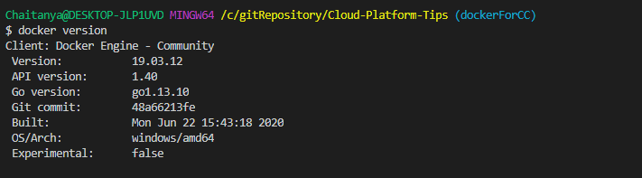
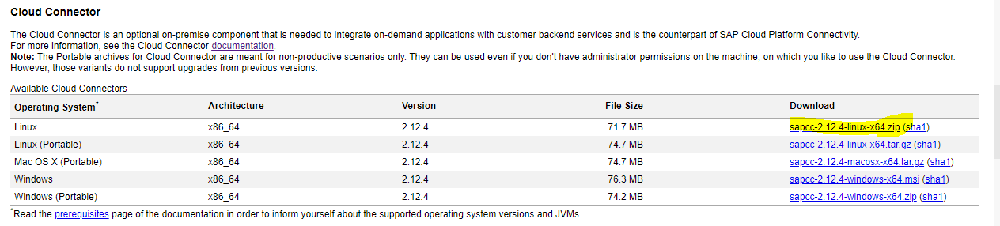
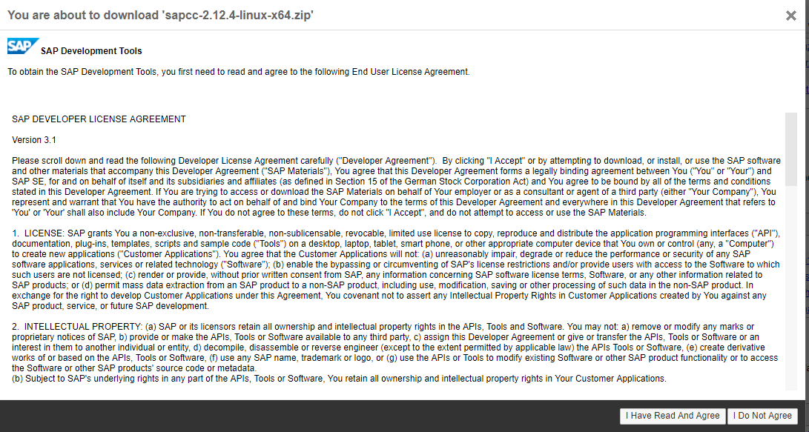
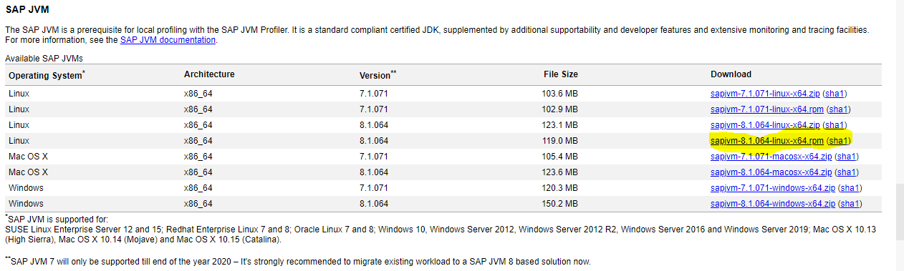

# Install and configure cloud connector

- [Install and configure cloud connector](#install-and-configure-cloud-connector)
  - [Prepare environment for Docker Image](#prepare-environment-for-docker-image)

## Prepare environment for Docker Image

- Check if docker is installed
  
- Create a new Directory and subdirectory called `container-scc/` and `sapdownloads/` respectively
- Go to the cloud section of the [SAP Development Tools website](https://tools.hana.ondemand.com/#cloud) and download the latest Cloud Connector component, placing it into the sapdownloads/ directory. Regardless of your local machine's operating system, you will need to download for Linux, as that is what the container will be running  
  

- From the same page, now download the latest SAP Java Virtual Machine (JVM) into the sapdownloads/ directory, again for Linux, and specifically the .rpm component 
