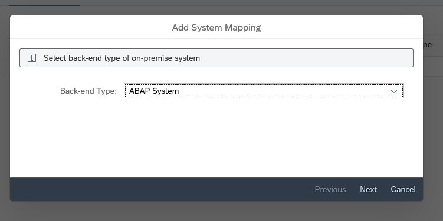

# Install and configure cloud connector

- [Install and configure cloud connector](#install-and-configure-cloud-connector)
  - [Prepare environment for Docker Image](#prepare-environment-for-docker-image)
  - [Build the Docker image](#build-the-docker-image)
  - [Instantiate a container](#instantiate-a-container)
  - [Connect to perform initial setup of the SAP Cloud Connector](#connect-to-perform-initial-setup-of-the-sap-cloud-connector)
  - [Make the SAP backend system available](#make-the-sap-backend-system-available)

## Prepare environment for Docker Image

- Check if docker is installed  
  
- Create a new Directory and subdirectory called `container-scc/` and `sapdownloads/` respectively
- Go to the cloud section of the [SAP Development Tools website](https://tools.hana.ondemand.com/#cloud) and download the latest Cloud Connector component, placing it into the sapdownloads/ directory. Regardless of your local machine's operating system, you will need to download for Linux, as that is what the container will be running  
  

- From the same page, now download the latest SAP Java Virtual Machine (JVM) into the sapdownloads/ directory, again for Linux, and specifically the .rpm component 

- Finally create a new file called Dockerfile in the container-scc/ directory (noting the capitalization and lack of extension on this file name)  

- Into this file, copy the contents of the [Dockerfile](./screenshots/DockerFileSample.txt) in this repository.

## Build the Docker image
-  Build the image, and after that you can instantiate a container from that image. In the **container-scc** directory (where the Dockerfile file is located), build the image as follows in this repository

 

- On successful completion the cloud connector should be installed. 
  
- Look for the image that's produced, with the following command
  
## Instantiate a container
- Now you have an image, it's time to instantiate a container from it. This will have Cloud Connector running inside it. Instantiate the container as follows: 

- Briefly, the parameters used here do the following:
  - -**p 8443:8443**: make port 8443 in the container available on the host machine (remember, SAP Cloud Connector listens by default on port 8443 and you want to be able to connect to it with your browser on your host machine)
  - **--name myscc**: this gives a human-friendly name to the container that can be used to refer to it in any subsequent commands
  - **-d**: run the container in "detached" mode, i.e. in the background
  - **scc**: this is the name of the image from which the container is to be created
- Check that the container is running, with another Docker command 

## Connect to perform initial setup of the SAP Cloud Connector
- Log on to the SAP Cloud Connector in your browser, and use the administration interface to perform some initial setup, in particular, connecting it to the SAP Cloud Platform
- Open your browser and go to the SAP Cloud Connector administration UI at https://localhost:8443. Remember that this is only possible because, with the -p 8443:8443 parameter earlier, you specified that port 8443 in the container (which is where SAP Cloud Connector is actually running and listening) should be exposed to your machine, the container's host (where Docker is running), also on port 8443. If this does not work on Chrome, try running on Internet Explorer

- At the "Cloud Connector Login" page, log in with the default username and password "**Administrator**" and "**manage**". You're then prompted to change this password which you should do, selecting the "Save" icon on the right hand side to proceed (leave other options as they are)

- Next, you're asked to specify an initial subaccount that you want the SAP Cloud Connector to connect to

## Make the SAP backend system available
- Now that the connection is established, you can define access to the on-prem backend SAP system that the SAP Cloud Connector will facilitate
- Select the "Cloud To On-Premise" item in the navigation menu on the left hand side, and in the "Mapping Virtual To Internal System" section, create a new system mapping entry with the "+" icon. In the dialog that follows, you can specify the details of your backend SAP system, i.e. the ES5 system

## Expose a set of resources in the backend system
- While you've established a mapping of a virtual host (that is visible at the SAP Cloud Platform level) to an internal (on-prem) host, there are still no accessible resources available on that host. You must specify these explicitly
- In the new "Resources of virtuales5:8000" section that is now visible, add a new resource entry with the "+" icon, specifying the following values and finishing with the "Save" button

| Setting           | Value                  |
| ----------------- | ---------------------- |
| URL Path          | /sap/opu/odata         |
| Active            | (checked)              |
| WebSocket Upgrade | (leave unchecked)      |
| Access Policy     | Path and all sub-paths |

