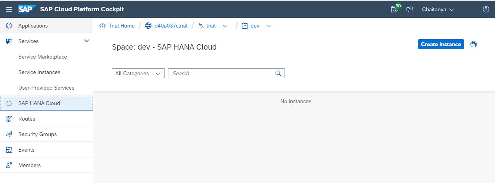
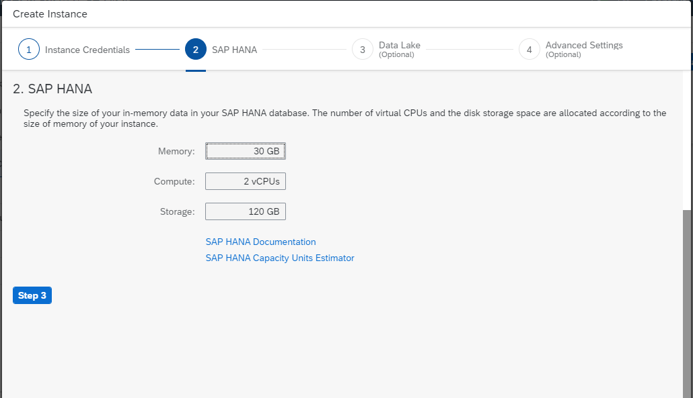

# Provision Hana Cloud on SAP Cloud Platform

- [Provision Hana Cloud on SAP Cloud Platform](#provision-hana-cloud-on-sap-cloud-platform)
  - [Setup CP Trail Account](#setup-cp-trail-account)
  - [Check Entitlements](#check-entitlements)
  - [Create Instance of Hana Cloud](#create-instance-of-hana-cloud)
  - [Import SFLIGHT Schema](#import-sflight-schema)

## Setup CP Trail Account
For information related to creating a new SAP Cloud Platform account refer to the [section](../../Setup%20CP%20trial/readme.md)

## Check Entitlements
Check entitlements are available as expected

## Create Instance of Hana Cloud
Create an instance as shown below

New Hana Cloud Instance is created

Open database explorer(check hana-cli [shortcut](../../../README.md#hana-cli-related)) and add the new database instance

## Import SFLIGHT Schema
Download SFLIGHT from [SAP Samples](https://github.com/SAP/hana-xsa-opensap-hana7/raw/snippets_2.3.2/ex2/sflight_hana.tar.gz) GITHUB repository. Once it is saved locally, right-click on the database created above and click Import Catalog Objects

Browse and import the file

Schema is created, and all relevant objects are imported

