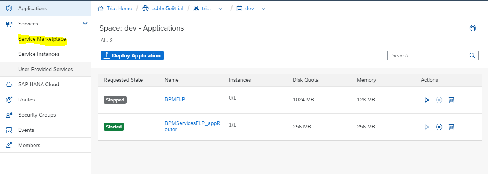
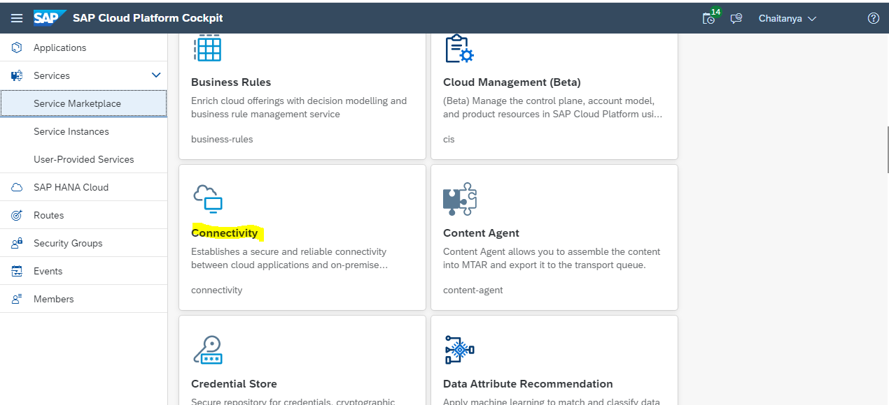

# Cloud Platform Services

- [Cloud Platform Services](#cloud-platform-services)
  - [Procedure to setup Cloud Platform Service](#procedure-to-setup-cloud-platform-service)

## Procedure to setup Cloud Platform Service
Select the "Service Marketplace" menu item (within the "Services" item in the menu on the left hand side)

Select the service from the Service Marketplace

Click the new instance button
