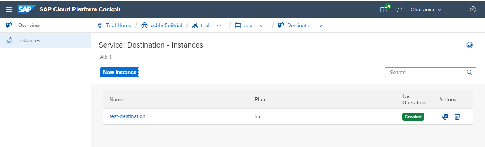

# Cloud Platform Services

- [Cloud Platform Services](#cloud-platform-services)
  - [Procedure to setup Cloud Platform Service](#procedure-to-setup-cloud-platform-service)
  - [Service Instance Parameters](#service-instance-parameters)
  - [Services Setup](#services-setup)
    - [Authorization & Trust Management](#authorization--trust-management)
    - [Destination](#destination)

## Procedure to setup Cloud Platform Service
Select the "Service Marketplace" menu item (within the "Services" item in the menu on the left hand side)

Select the service from the Service Marketplace

Click the new instance button

## Service Instance Parameters
| Service                          | Technical Name | Service Plan  | Parameters                                                 | Assign Application | Instance Name      |
| -------------------------------- | -------------- | ------------- | ---------------------------------------------------------- | ------------------ | ------------------ |
| Authorization & Trust Management | `xsuaa`        | `application` | Upload the `xs-security.json` file via the "Browse" button | (none)             | `test-xsuaa`       |
| Destination                      | `destination`  | `lite`        | (none)                                                     | (none)             | `test-destination` |

## Services Setup
### Authorization & Trust Management
To create an Authorization & Trust Management service select the same in Service Marketplace and create a new instance as show below

### Destination
To create a Destination service select the same in Service Marketplace and create a new instance as show below

