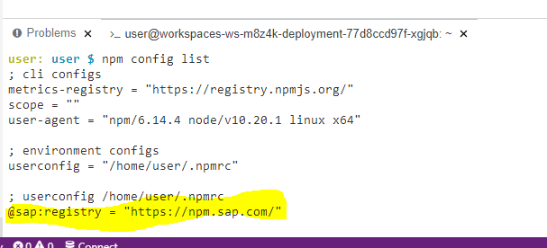
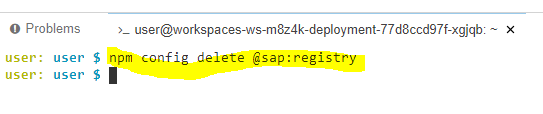

# SAP Cloud Platform Reference Guide

**[Table of Contents]**

- [SAP Cloud Platform Reference Guide](#sap-cloud-platform-reference-guide)
  - [Setup Cloud Platform Trial Account](./Setup%20CP%20trial/readme.md)
  - [Important Github Repositories](#important-github-repositories)
  - [Basic NPM Installs](#basic-npm-installs)
  - [Create account on ES5 System](#create-account-on-es5-system)
  - [Remove SAP Registry from NPM](#remove-sap-registry-from-npm)
  - [Business Application Studio Setup](./Business%20Application%20Studio%20Related/readme.md)
  - [Install and configure cloud connector](./Docker%20for%20Cloud%20Connecter%20Related/readme.md)
  - [Create Destination in cloud platform](./Create%20Destination%20in%20CP/readme.md)
  - [Hana Cloud Account Setup](./Hana%20Cloud%20Related/readme.md)

## Important Github Repositories
| Repository Name                             | Link                                                                 |
| ------------------------------------------- | -------------------------------------------------------------------- |
| Virtual Event - SAP Cloud Platform Workflow | https://github.com/SAP-samples/cloud-platform-workflow-virtual-event |

## Create account on ES5 System
To create an account on the SAP NetWeaver Gateway Demo system "ES5", [Sign up here](https://register.sapdevcenter.com/SUPSignForms/) and then ensure your account is active and the username and password are correct, by checking you can access HTTP-based services such as the [EPM_REF_APPS_SHOP_SRV](https://sapes5.sapdevcenter.com/sap/opu/odata/sap/EPM_REF_APPS_SHOP_SRV/?sap-client=002) OData service. If you need more help, you can follow the ["Create an Account on the Gateway Demo System"](https://developers.sap.com/tutorials/gateway-demo-signup.html) tutorial.
## Basic NPM Installs

| NPM Module  | Description                                                                                                                                                                                                       |
| ----------- | ----------------------------------------------------------------------------------------------------------------------------------------------------------------------------------------------------------------- |
| @sap/cds-dk | The command line client and development toolkit for the SAP Cloud Application Programming Model (CAP).   To install run the npm command   `npm i -g @sap/cds-dk`                                            |
| hana-cli    | A developer-centric HANA command line tool, particularly designed to be used when performing local HANA development in non-SAP tooling (like VSCode)   To install run the npm command   `npm i -g hana-cli` |

## Remove SAP Registry from NPM
Ensure that NPM Config List doesnt have a SAP registry entry

## Blogs for reference
| Blog                                     | Link                                                                                                |
| ---------------------------------------- | --------------------------------------------------------------------------------------------------- |
| Import large data into Hana using python | https://blogs.sap.com/2020/09/03/import-large-flat-files-into-sap-hana-using-python-and-sqlalchemy/ |