# SAP Cloud Platform Reference Guide

**[Table of Contents]**

- [SAP Cloud Platform Reference Guide](#sap-cloud-platform-reference-guide)
  - [Business Application Studio Setup](#business-application-studio-setup)
  - [Basic NPM Installs](#basic-npm-installs)
  - [Install and configure cloud connector](#install-and-configure-cloud-connector)
    - [Prepare environment for Docker Image](#prepare-environment-for-docker-image)

## Business Application Studio Setup

Login to SAP Cloud Platform trial and navigate to subaccount
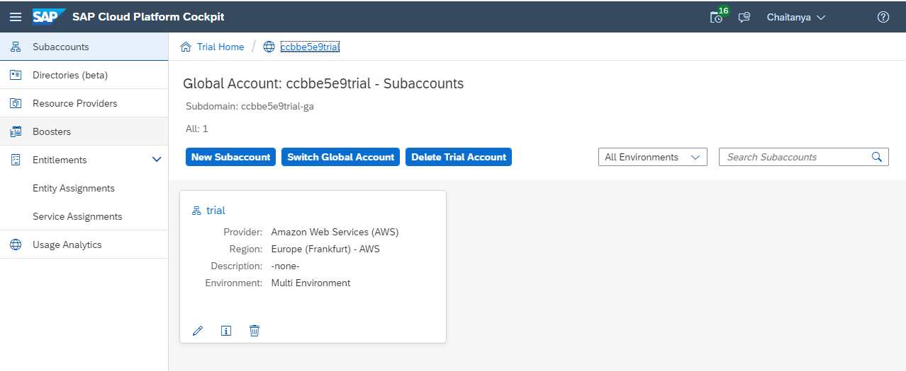

Select the Subscriptions menu item on the left hand side. Find and select the "SAP Business Application Studio" tile and use the "Subscribe" button to create a subscription to it in your account
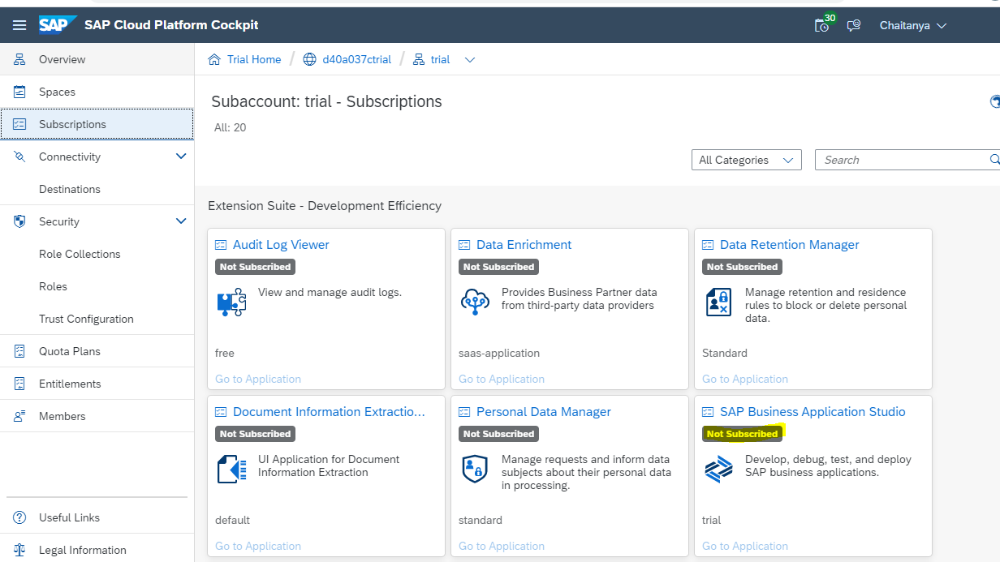

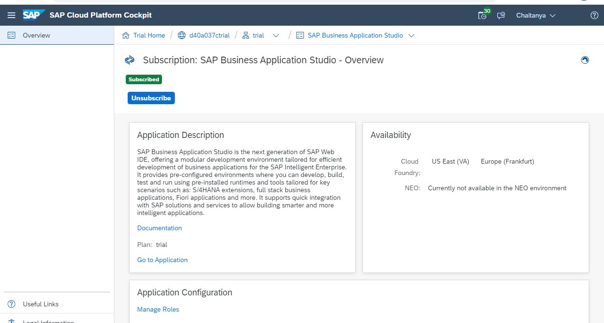

Once subscribed, the "Go to Application" link become active. But before launching it, ensure that appropriate App Studio roles are available.

Jump to the subaccount overview page, and select the "Trust Configuration" item within the "Security" entry in the menu on the left hand side. Select the "sap.default" entry as shown in the screenshot (it may be a different name, but it is usually going to be the only entry to select anyway), and in the following screen, enter your ID - the email address associated with your account - and select the "Show Assignments" button to bring up the current list, and to give you the ability to assign further Role Collections

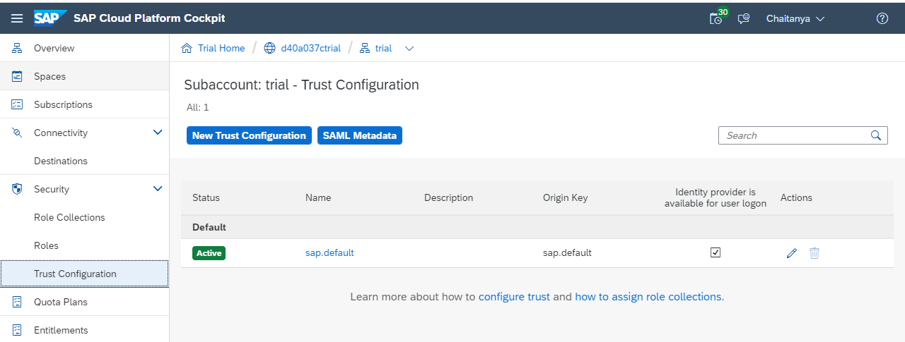

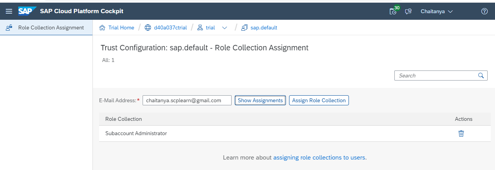

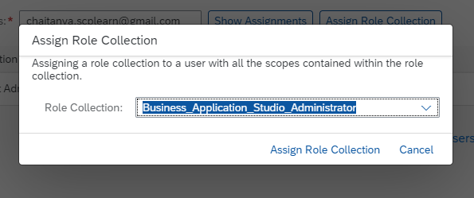

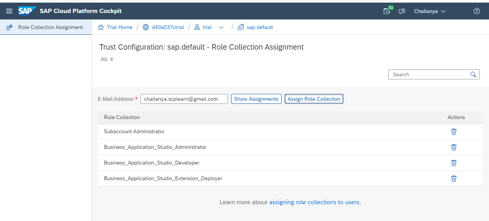

Go back to the App Studio subscription page, and use the "Go to Application" link.

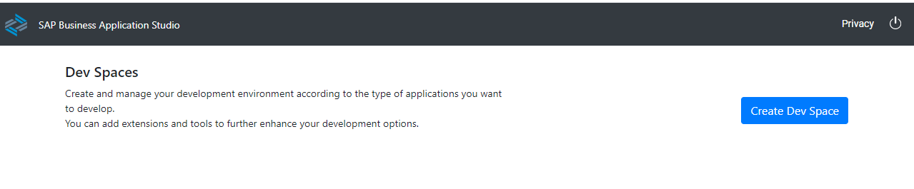

Select the "Create Dev Space" button and should specify a name for your space, and the extensions you want. Give a name to the workspace and select the appropriate options as required

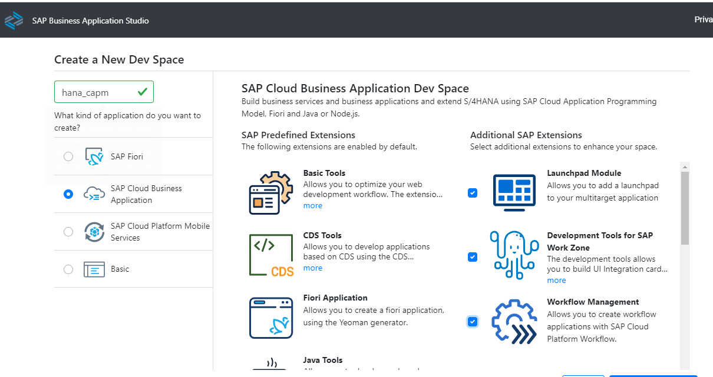

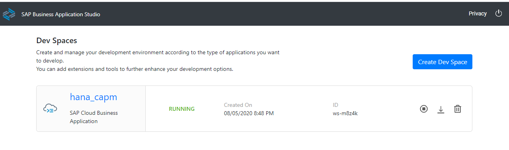

There's one final activity to complete at this stage, and that's to point tge new Dev Space to your CF organization and space.

In the bar at the bottom, there'll be a message along these lines: "The organization and space in Cloud Foundry have not been set". Select this message to initiate a short UI interaction at the top of the screen to allow you to confirm the settings. Specify the following:

| Setting                | Value to set                                                                                                                                                                                            |
| ---------------------- | ------------------------------------------------------------------------------------------------------------------------------------------------------------------------------------------------------- |
| Cloud Foundry endpoint | This is the endpoint in the form https://api.cf.<region>.hana.ondemand.com. Refer to the details shown in your Trial Subaccount overview page   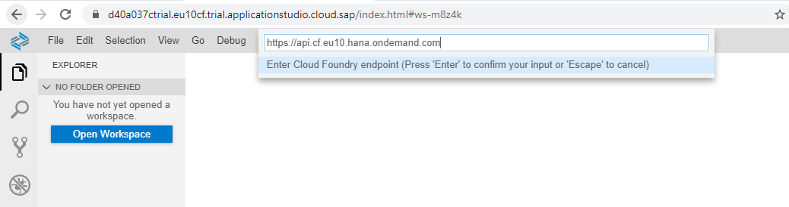 |
| Email address          | This is the email address associated with the Cloud Platform account.   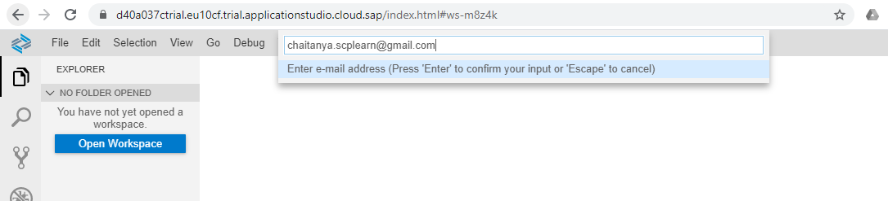                                                                            |
| Password               | This is the password associated with the email address and this account.   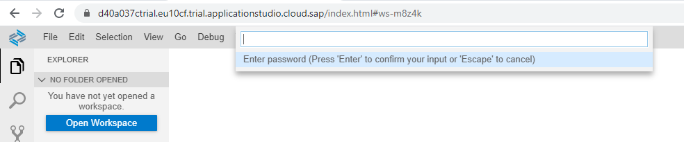                                                                      |
| Organization           | This is the CF organization associated with your trial subaccount   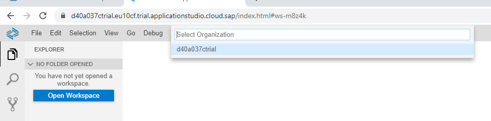                                                                                  |
| Space                  | This is the space within the organization   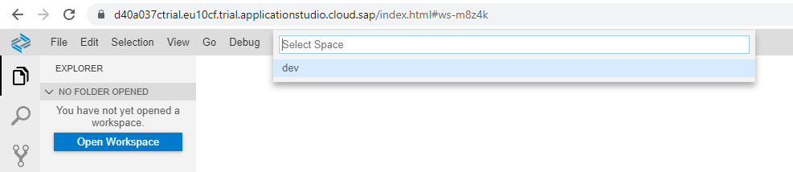                                                                                                    |

Once the above steps are performed, Business application studio is ready for use with the SAP Cloud platform account

## Basic NPM Installs

| NPM Module  | Description                                                                                                                                                                                                       |
| ----------- | ----------------------------------------------------------------------------------------------------------------------------------------------------------------------------------------------------------------- |
| @sap/cds-dk | The command line client and development toolkit for the SAP Cloud Application Programming Model (CAP).   To install run the npm command   `npm i -g @sap/cds-dk`                                            |
| hana-cli    | A developer-centric HANA command line tool, particularly designed to be used when performing local HANA development in non-SAP tooling (like VSCode)   To install run the npm command   `npm i -g hana-cli` |

## Install and configure cloud connector

### Prepare environment for Docker Image

- Create a new Directory and subdirectory called `container-scc/` and `sapdownloads/` respectively
