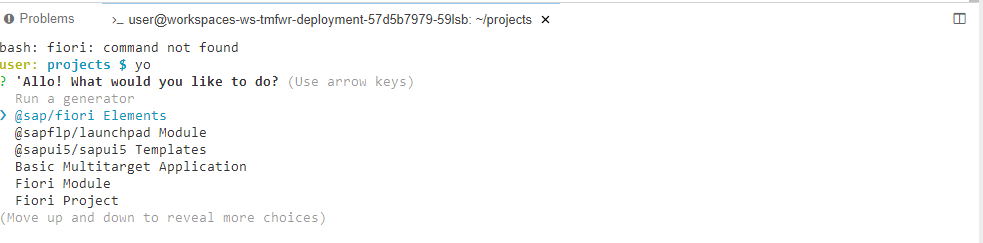
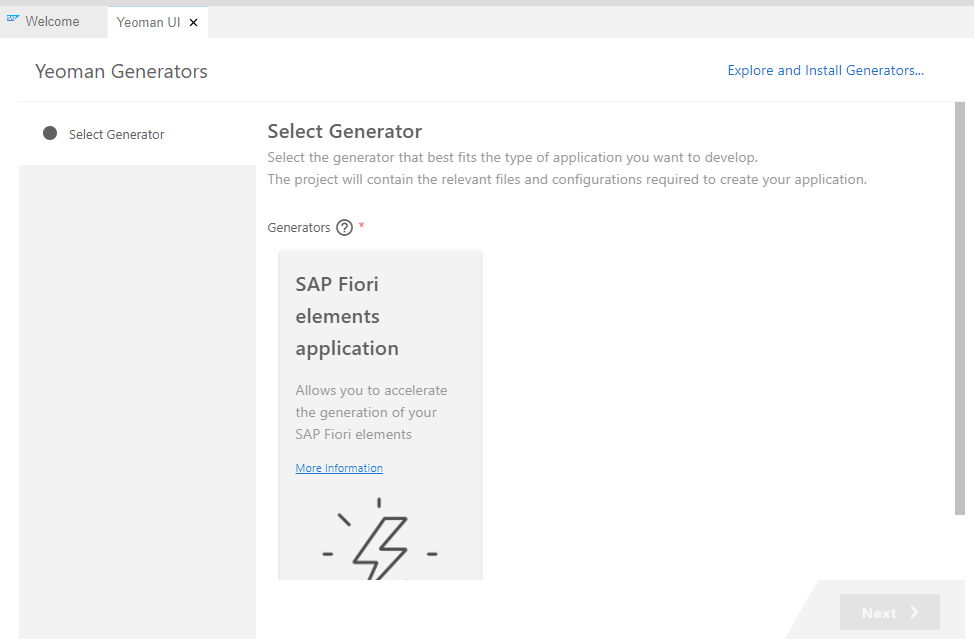

# Fiori Tools related

SAP Fiori tools is an extension pack available for Visual Studio Code and SAP Business Application Studio that is designed to increase the efficiency of SAP Fiori elements app development. SAP Fiori is SAP’s user experience, intended to provide end-users with apps that are role-based, adaptive, coherent, simple, and delightful. SAP Fiori elements provides predefined page types for SAP Fiori development, allowing users to quickly create SAPUI5 apps while taking advantage of the user interface provided by SAP. SAP Fiori tools allows users to easily generate SAP Fiori elements apps, modify the app’s functionality, generate new pages, and preview the application with both backend and mock data

- [Fiori Tools related](#fiori-tools-related)
  - [Set Up SAP Fiori Tools in Your Development Environment](#set-up-sap-fiori-tools-in-your-development-environment)


## Set Up SAP Fiori Tools in Your Development Environment
Install VSCode if using VSCode and Install SAP Fiori tools from VSCode Marketplace. This snippet covers the installation of Fiori tools in SAP Business Application studio. For reference about SAP BAS and setup, refer the [link](../../Cloud%20Platform%20related/Business%20Application%20Studio%20Related/Setup%20Related/readme.md)


Check if the fiori generator is available via the `yo` command


Alternatively, the same can be checked by pressing F1 and searching for `SAP Fiori Tools - Application generator - Launch`



If the same is not found in workspace run the following command and check again

```sh
npm i -g @sap/generator-fiori-elements
```


