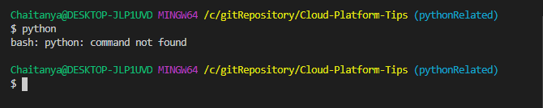
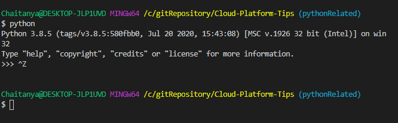
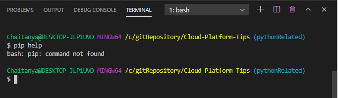
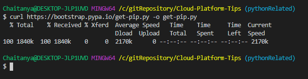

# Python related tips

## Install Python on Windows
### What is Python
Python is an open-source programming language that allows you to run applications and plugins from a wide variety of 3rd party sources (or even applications you develop yourself) on your server. Python is cross-platform, meaning that you can run it on a number of different operating systems, including Windows VPS Server

### Confirm that Python is installed
The simplest way to test for a Python installation on your Windows server is to open a command prompt. Once a command prompt window opens, type python and press Enter.

`python`

### Install Python
Download python from [Link](https://www.python.org/)

## Install PIP on Windows
Pip is one of the best tools to install and manage Python packages. Pip has earned its fame by the number of applications using this tool. Used for its capabilities in handling binary packages over the easily installed package manager, Pip enables 3rd party package installations.

### Check if Pip is Already Installed

Run the command 
`pip help `

### Install Pip
Run the command
`curl https://bootstrap.pypa.io/get-pip.py -o get-pip.py`

Then run the following command in the folder where you have downloaded ***get-pip.py***

`python get-pip.py`

Ensure path variables are set for both python and pip to work